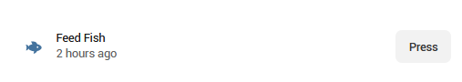
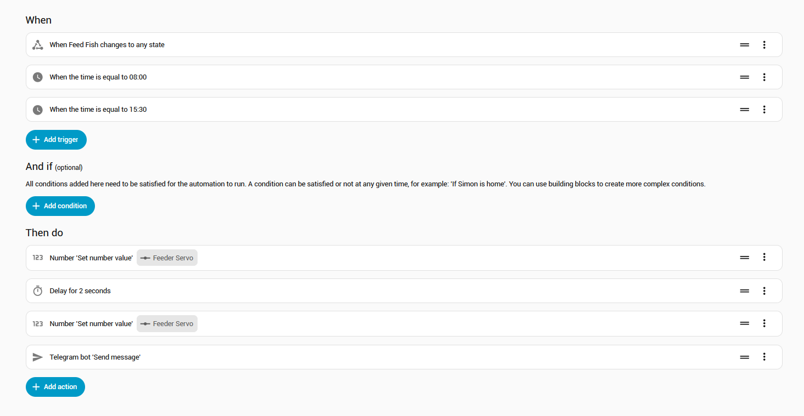

# ESPHome instructions for nahueltaibo/fish-feeder

This project can also work very smoothly with ESPHome and the ESP8266, as well as the ESP32 range.

## Print and assemble the kit exactly as described;

- [Thingiverse Printer Files](https://www.thingiverse.com/thing:6378659)
- [Assembly instructions](https://www.youtube.com/watch?v=o45096FO8ds)

When assembled, you should have the SG90 servo motor fitted, with the wires emerging from the hole in the base. You may need to extend the wires to reach your ESP.

## Connect to your ESP8266

- Red Wire = 5v. This also operates on 3.3v directly to your ESP chip. Connect either to a 5v feed, or to one of the 3.3v pins on the ESP8266
- Brown Wire = GND. Connect this to one of the GND pins on your ESP8266
- Orange (or Yellow) Wire = Signal. Connect this to your chosen signal pin. Choose from one of the following pins, which support PWM control
  - D1 (GPIO5)
  - D2 (GPIO4)
  - D5 (GPIO14)
  - D6 (GPIO12)
  - D7 (GPIO13)

*(ESP32 connection is almost identical, but ensure your chosen signal pin is PWM capable)*

## The Yaml code block for the device, assuming you are using pin D1 from the above, would be:

```
output:
  - platform: esp8266_pwm
    id: pwm_output
    pin: D1
    frequency: 50Hz

servo:
  - id: my_servo
    output: pwm_output

number:
  - platform: template
    name: "Feeder Servo"
    min_value: -100
    initial_value: 0
    max_value: 100
    step: 1
    optimistic: true
    set_action:
      then:
        - servo.write:
            id: my_servo
            level: !lambda 'return x / 100.0;'

```

Explanation: This tells ESPHome that the ESP8266 has a servo connected to D1, and to create a number slider in Home Assistant with a range of -100 through +100

## Now compile and flash your ESP8266 in your normal way.

I use esphome on linux, but there are many ways to do this, including through the browser.

The logs after it restarts should contain some strings similar to

```
[20:41:02.132][C][esp8266_pwm:021]: ESP8266 PWM:
[20:41:02.132][C][esp8266_pwm:021]:   Frequency: 50.0 Hz
[20:41:02.132][C][esp8266_pwm:152]:   Pin: GPIO12
[20:41:02.132][C][template.number:016]: Template Number 'Feeder Servo'
[20:41:02.132][C][template.number:049]:   Optimistic: YES
[20:41:02.132][C][template.number:453]:   Update Interval: 60.0s
[20:41:02.133][C][servo:014]: Servo:
[20:41:02.133][C][servo:014]:   Idle Level: 7.5%
[20:41:02.133][C][servo:014]:   Min Level: 3.0%
[20:41:02.133][C][servo:014]:   Max Level: 12.0%
[20:41:02.133][C][servo:014]:   Auto-detach time: 0 ms
[20:41:02.133][C][servo:014]:   Run duration: 0 ms
```

Now in Home Assistant, under Integrations -> ESPHome -> Your ESP8266, you should see something like this;


Moving the slider should move the servo to the correct position. For me, -100 has the hole positioned inside the silo, and +100 moves it above the drop hole.

If that's working for you, you can move onto automations.

## Suggested automations

To ease with automations, I created a "Helper" in Home Assistant of type "Input Button"


This can be used on a dashboard to create a button, like so:




A full automation might look something like the following.



- First trigger is the above button, so I can feed manually, and this also operates twice during the day by schedule

- First Action is to set the number to `100` to move the disk above the drop hole. Then it pauses for 2 seconds and then moves the disk back under the flakes to pick up a new load.  Then it sends me a Telegram so I know it's worked. The time on the above dashboard button also updates automatically to show when it was last used.

The entire yaml for this automation is:

```
alias: Feed Fish
description: ""
triggers:
  - trigger: state
    entity_id:
      - input_button.feed_fish
    to: null
  - trigger: time
    at: "08:00:00"
  - trigger: time
    at: "15:30:00"
conditions: []
actions:
  - action: number.set_value
    metadata: {}
    target:
      entity_id: number.fishtankesp01_feeder_servo
    data:
      value: "100"
  - delay:
      hours: 0
      minutes: 0
      seconds: 2
      milliseconds: 0
  - action: number.set_value
    metadata: {}
    target:
      entity_id: number.fishtankesp01_feeder_servo
    data:
      value: "-100"
  - action: telegram_bot.send_message
    metadata: {}
    data:
      title: Fish fed!
      message: The fish have been fed
mode: single
```
